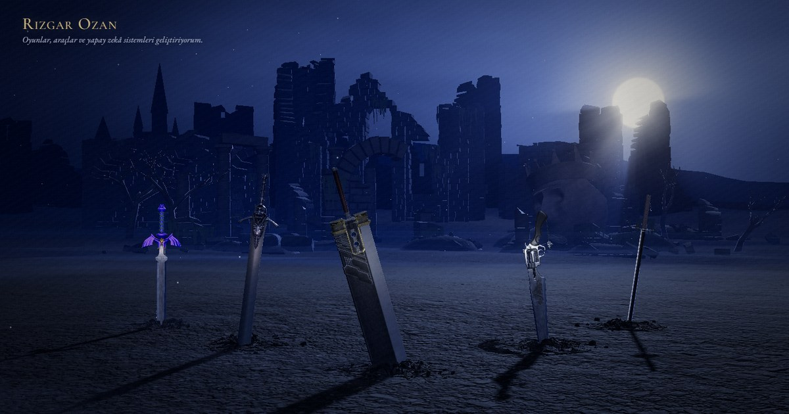

<a href="https://rizgarozan.github.io"></a>

# rizgarozan.github.io

My portfolio, as a sword graveyard: every sword standing in the field is a project I've
published. Open one and it rises out of the earth with its write-up beside it. Scroll down and
the camera goes underground into a smithy, where the anvil holds what I'm working on now, a
slate board lists my open-source contributions, and a rack holds blades with no project yet.

The sky follows my clock in Ankara, day or night, and the board guesses where I probably am
(at school, asleep, or at the anvil). The hammer only swings when I'm likely to be working.
Turkish and English; every word is plain HTML, so the page reads without WebGL as a list.

**Live:** https://rizgarozan.github.io

## How it's built

- three.js r170 and GSAP, no framework. `src/` is bundled by esbuild into `dist/` (main file,
  a shared chunk, and the smithy as its own chunk loaded on the way down).
- Models are meshopt-compressed GLBs with WebP textures. The weapons are fan models from
  Sketchfab, kept as they are apart from cleanup, scale and texture fixes; the ruins, the
  smithy and the craters are generated in Blender by the scripts in `tools/blender/`.
- Shaders are compiled off the main thread and landed in batches (`src/scene/warm.js`), so
  new things arriving never freeze a frame. Quality adapts to the frame time: light shafts
  first, then depth of field, then shadow detail, then resolution (never below 1.25 on a phone).

### Built for a slow line

I live in a dorm where the connection is about 25 KB/s, so the site has to work there.

- The first frame waits for nothing but the code (~240 KB) and four subset fonts (~90 KB):
  the ground is drawn plain and its texture fades in when it lands.
- The field stands on light copies of the swords (512 px textures, simplified heavy parts,
  about 600 KB for all five). Opening a sword fetches its full model and swaps it in.
- Downloads go through one priority queue: swords first, then the ruins near the field, then
  the far kingdom. Big files go one at a time and never take the last free slot.
- Sharper ground, every sword's full copy and the smithy are only fetched ahead of time when
  the measured line speed allows it.

Measured on that 25 KB/s line: the scene is up in 13.5 s, all five swords in 51 s. On a normal
connection the first view is about 2.3 MB.

## Working on it

```sh
node tools/build.mjs              # bundle src/ into dist/ (run after any change in src/)
sh tools/optimize-assets.sh       # compress new GLBs: light copies, -hd copies, the smithy
node tools/ruins-lod.mjs          # ruins-near/far.glb from the Blender export
sh tools/fonts.sh <4 ttf files>   # subset the web fonts into assets/fonts/
sh tools/cv/build.sh              # print the two CV pages to PDF
```

Blender scripts run headless, e.g.
`blender -b --factory-startup -P tools/blender/ruins.py`. Any static server works for local
testing; the site uses only relative paths. Add `?debug` for a console hook, `?diag` for an
on-screen quality readout, `?hour=14` to pin the sky, `?lang=en` for English.

## Credits

Weapon models from Sketchfab, used under their authors' licenses (also listed on the site,
in the small "kaynaklar" tab in the corner):

| Model | Author | License |
|---|---|---|
| [Buster Sword](https://sketchfab.com/3d-models/final-fantasy-7-buster-sword-9b931e7276c54c25ba919393f23500e4) | Dharvey296 | CC BY 4.0 |
| [Rebellion](https://sketchfab.com/3d-models/rebellion-sword-game-asset-devil-may-cry-5-07a2646d166b469daa6bf41028d5e4cc) | ScreamingHomie | CC BY-NC 4.0 |
| [Master Sword](https://sketchfab.com/3d-models/master-sword-legend-of-zelda-fan-art-1e6d1805959b4ed3b7ad92fdee480ef6) | Yogensia | CC BY-NC-SA 4.0 |
| [Tensa Zangetsu](https://sketchfab.com/3d-models/tensa-zangetsu-27a18833edf44f25800d470c54067cb5) | JohnHB | CC BY 4.0 |
| [Oathkeeper](https://sketchfab.com/3d-models/oblivion-and-oathkeeper-23d699c6ebb846259b0edbdedaa47efc) | chek360 | CC BY 4.0 |
| [Revolver (gunblade)](https://sketchfab.com/3d-models/gunblade-from-ffviii-66562b7ae1744c7a80f68d67af8f25f0) | nikexz | CC BY 4.0 |
| [Pure Nail](https://sketchfab.com/3d-models/hollow-knight-pure-nail-5ff6de0de67d498987a0c8cc534dee03) | João Desager | CC BY 4.0 |
| [Leviathan Axe](https://sketchfab.com/3d-models/leviathan-axe-09974baf271e498f94a92e284217d56e) | Sky_Hunter | CC BY 4.0 |
| [Blades of Chaos](https://sketchfab.com/3d-models/blades-of-chaos-from-god-of-war-a914101b147a4d86a440e76acc946bc8) | John Machine | CC BY 4.0 |

The weapon designs and names belong to their games and publishers; this site is
non-commercial. Ground and stone textures from [Poly Haven](https://polyhaven.com) (CC0, see
`assets/textures/CREDITS.txt`). Sound recordings are listed in `assets/audio/CREDITS.txt`. Fonts:
Cormorant Garamond and EB Garamond (SIL Open Font License). three.js (MIT) and GSAP (GreenSock
standard license) are vendored in `vendor/`.
